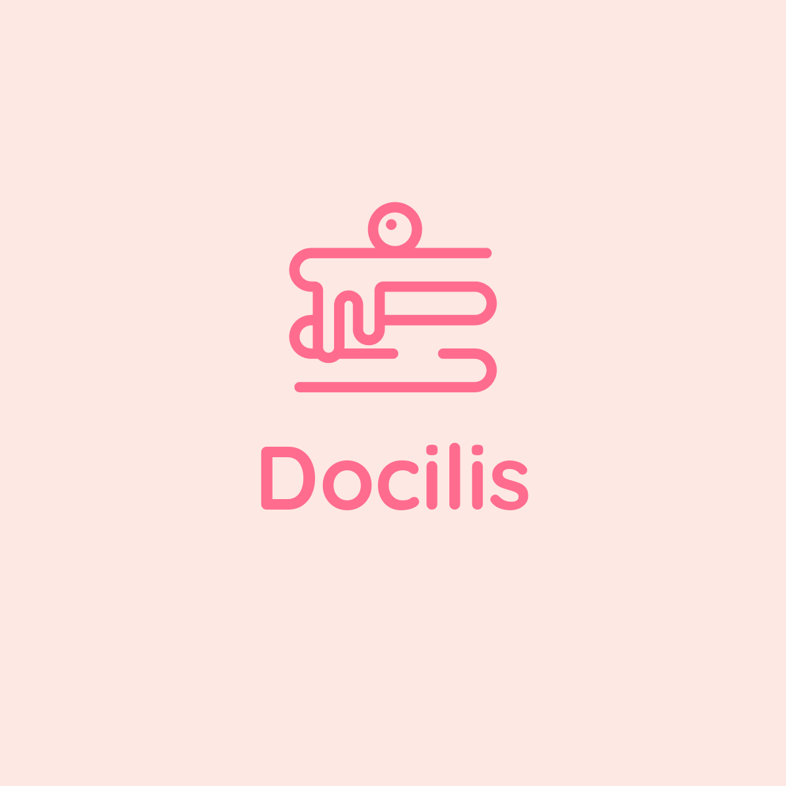

  

<h1 align="center">Docilis-API-Backend 🍰</h1>

## 🌐 Visão Geral

O Docilis-API-Backend é o núcleo do sistema Docilis, uma solução robusta e escalável desenvolvida para gerenciar e otimizar operações relacionadas a confeitarias e pedidos. Construído com a tecnologia NestJS, este backend foi projetado para oferecer desempenho, segurança e facilidade de manutenção.

## 🌟 Características

- **Modularidade**: A arquitetura modular permite uma separação clara de responsabilidades e facilita a manutenção e expansão do código.
- **Performance**: Otimizado para lidar com grandes volumes de dados com eficiência.
- **Segurança**: Implementa as melhores práticas de segurança para proteger os dados e garantir a integridade do sistema.

## 🏗️ Arquitetura

O projeto segue uma estrutura bem definida, focada na clareza e organização do código. Para uma visão detalhada da arquitetura e estrutura do projeto, consulte o documento [ARQUITETURA.md](./docs/ARCHITECTURE.md).

## 🚀 Configuração e Execução

1. Clone o repositório para sua máquina local.
2. Navegue até o diretório do projeto e instale as dependências usando `yarn install`.
3. Configure as variáveis de ambiente conforme necessário.
4. Execute o projeto usando `yarn start:prod`.

## 📚 Documentação

A documentação completa do projeto, incluindo detalhes da API, modelos de dados e fluxos de trabalho, pode ser encontrada no diretório `/docs`.

## 📞 Suporte

Para qualquer dúvida ou problema relacionado ao projeto, entre em contato diretamente pelo e-mail: [sidinei.silva02@gmail.com](mailto:sidinei.silva02@gmail.com).

## 📜 Licença

Este projeto é propriedade exclusiva e não está disponível para distribuição ou uso externo sem permissão prévia.

---

© 2023 [Sidinei Silva]. Todos os direitos reservados.
